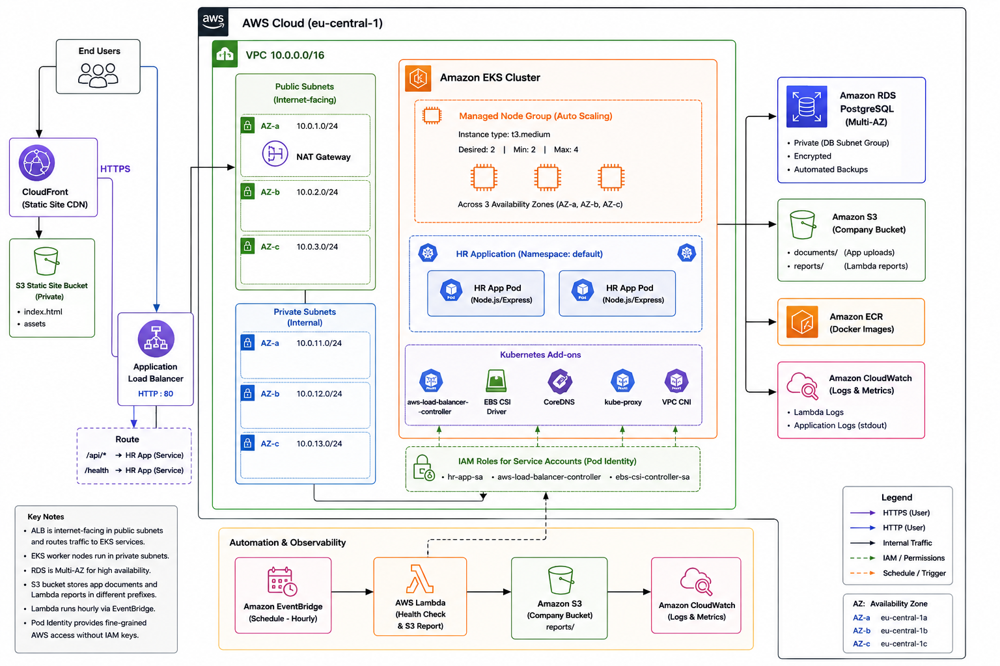

# EKS Corp Platform


A production-grade AWS infrastructure portfolio project built with Terraform, featuring an EKS-hosted HR management backend, managed database, S3 storage, Lambda automation, and a CloudFront static website.

> ⚠️ This is a learning/portfolio project. It requires an AWS account, configured CLI tools, and Docker Desktop. It is not a one-click deploy.

---

## 📐 Architecture

The platform is deployed on AWS using EKS, Terraform, and managed services.



---

## ✨ Features

- **EKS Cluster** – Multi-AZ managed Kubernetes with autoscaling node groups
- **HR Backend API** – Node.js/Express with JWT auth, employee CRUD, S3 document handling
- **Private ECR** – Docker image registry with lifecycle policy
- **RDS PostgreSQL** – Multi-AZ managed database
- **Company S3 Bucket** – Folder-level IAM policies for documents and reports
- **Pod Identity** – Keyless AWS permissions for pods via IAM roles
- **Lambda Automation** – Hourly health check + S3 metadata report
- **CloudFront Static Site** – Cheap, fast static website via CDN
- **Terraform Remote State** – S3 backend with DynamoDB lock
- **Make.sh** – Single-command infrastructure management

---

## 🛠️ Built With

[![Terraform][Terraform]][Terraform-url]
[![AWS][AWS]][AWS-url]
[![Kubernetes][Kubernetes]][Kubernetes-url]
[![Docker][Docker]][Docker-url]
[![Node.js][Node.js]][Node-url]
[![Express.js][Express.js]][Express-url]
[![PostgreSQL][PostgreSQL]][PostgreSQL-url]
[![Amazon EKS][EKS]][EKS-url]
[![Amazon RDS][RDS]][RDS-url]
[![Amazon S3][S3]][S3-url]
[![AWS Lambda][Lambda]][Lambda-url]
[![Amazon CloudFront][CloudFront]][CloudFront-url]
[![Helm][Helm]][Helm-url]
[![JWT][JWT]][JWT-url]

---

## 🛠️ Tech Stack

| Category | Technology |
|----------|-----------|
| Infrastructure | Terraform, AWS |
| Container Orchestration | Kubernetes (EKS) |
| Backend | Node.js, Express.js |
| Database | PostgreSQL (RDS) |
| Container Registry | AWS ECR |
| Storage | AWS S3 |
| CDN | AWS CloudFront |
| Serverless | AWS Lambda |
| Package Manager (K8s) | Helm |
| Auth | JWT |

---

## 📋 Prerequisites

### Tools

Make sure you have the following installed:

```bash
# Check versions
terraform --version    # >= 1.5.0
aws --version          # AWS CLI v2
kubectl version        # latest
helm version           # v3+
docker --version       # latest
jq --version           # latest
```

Install on Mac:
```bash
brew install terraform awscli kubectl helm jq
```

Docker Desktop: https://www.docker.com/products/docker-desktop/

> Make sure Docker Desktop is **running** before executing `./Make.sh up`.

---

### ☁️ AWS Setup

#### 1. AWS Account
You need an AWS account with sufficient permissions. AdministratorAccess is recommended for this project.

#### 2. AWS CLI Configuration
```bash
aws configure
```

Enter your:
- **AWS Access Key ID**
- **AWS Secret Access Key**
- **Default region:** `eu-central-1`
- **Default output format:** `json`

Verify it works:
```bash
aws sts get-caller-identity
```

#### 3. Required AWS Permissions
Your IAM user or role needs permissions for:
- EKS, EC2, VPC, RDS, S3, ECR
- Lambda, EventBridge, CloudFront
- IAM (role and policy creation)
- DynamoDB

---

## 🚀 Quick Start

### 1. Clone the repository

```bash
git clone https://github.com/yourusername/eks-corp-platform.git
cd eks-corp-platform
```

### 2. Create environment file

```bash
cp .env.example .env
```

Fill in the required values:

```bash
# .env
JWT_SECRET=your-strong-jwt-secret
DB_PASSWORD=your-strong-db-password
```

### 3. Make the scripts executable

```bash
chmod +x Make.sh
chmod +x test.sh
```

### 4. Start the infrastructure

```bash
./Make.sh up
```

This will:
1. Apply Terraform backend setup (S3 + DynamoDB)
2. Apply Terraform infra (VPC, EKS, RDS, ECR, S3, Lambda, CloudFront)
3. Update kubeconfig
4. Build and push Docker image to ECR
5. Install AWS Load Balancer Controller via Helm
6. Create Kubernetes secrets from `.env`
7. Apply Kubernetes manifests
8. Wait for ALB and update Lambda health URL
9. Sync static site to S3

> ⏱️ Full setup takes approximately **20-25 minutes** due to EKS and RDS provisioning.

### 5. Tear down

```bash
./Make.sh down
```

---

## 📁 Project Structure

```
eks-corp-platform/
├── Make.sh                     # Infrastructure automation script
├── test.sh                     # API endpoint test script
├── .env.example                # Environment variable template
│
├── terraform/
│   ├── backend-setup/          # S3 + DynamoDB for Terraform state
│   │   └── main.tf
│   └── infra/                  # Main infrastructure
│       ├── backend.tf
│       ├── main.tf
│       ├── variables.tf
│       ├── outputs.tf
│       ├── providers.tf
│       ├── versions.tf
│       └── modules/
│           ├── vpc/            # VPC, subnets, IGW, NAT
│           ├── eks/            # EKS cluster, node groups, addons, Pod Identity
│           ├── ecr/            # ECR repository
│           ├── rds/            # RDS PostgreSQL Multi-AZ
│           ├── s3/             # Company S3 bucket + IAM policies
│           ├── lambda/         # Health check Lambda + EventBridge
│           └── cloudfront/     # CloudFront + static site S3
│
├── app/                        # Node.js backend application
│   ├── Dockerfile
│   ├── package.json
│   └── src/
│       ├── index.js
│       ├── db.js
│       ├── routes/
│       │   ├── health.js
│       │   ├── auth.js
│       │   ├── employees.js
│       │   └── documents.js
│       └── middleware/
│           └── auth.js
│
├── k8s/                        # Kubernetes manifests
│   ├── deployment.yaml
│   ├── service.yaml
│   ├── ingress.yaml
│   ├── serviceaccount.yaml
│   └── test-pvc.yaml
│
├── lambda/                     # Lambda function code
│   └── health-check/
│       ├── index.js
│       └── package.json
│
└── static-site/                # CloudFront static website
    ├── index.html
    └── style.css
```

---

## 🔌 API Endpoints

All endpoints (except `/health`) require a JWT token in the `Authorization: Bearer <token>` header.

### Auth
| Method | Endpoint | Description |
|--------|----------|-------------|
| POST | `/auth/register` | Register a new user |
| POST | `/auth/login` | Login and receive JWT token |

### Employees
| Method | Endpoint | Description |
|--------|----------|-------------|
| GET | `/employees` | List all employees |
| GET | `/employees/:id` | Get a single employee |
| POST | `/employees` | Create a new employee |
| PUT | `/employees/:id` | Update an employee |
| DELETE | `/employees/:id` | Delete an employee |

### Documents (S3)
| Method | Endpoint | Description |
|--------|----------|-------------|
| GET | `/documents/upload-url/:employeeId/:filename` | Get presigned S3 upload URL |
| GET | `/documents/download-url/:employeeId/:filename` | Get presigned S3 download URL |

### Health
| Method | Endpoint | Description |
|--------|----------|-------------|
| GET | `/health` | App and database status |

---

## 🧪 Testing

Run the automated API test script:

```bash
./test.sh
```

This tests all endpoints sequentially with formatted JSON output.

---

## ⚙️ Make.sh Commands

```bash
./Make.sh up       # Full infrastructure setup
./Make.sh down     # Tear down all infrastructure
./Make.sh push     # Build and push Docker image to ECR
./Make.sh lambda   # Deploy updated Lambda function code
./Make.sh secrets  # Apply Kubernetes secrets from .env
```

---

## 🔐 Security

- All S3 buckets are private with public access blocked
- Pods access AWS services via **Pod Identity** (no static credentials)
- Database is in private subnets (no public access)
- JWT authentication on all protected endpoints
- Passwords and secrets stored in Kubernetes Secrets (not in code)
- ECR image scanning enabled on push

[Terraform]: https://img.shields.io/badge/Terraform-844FBA?style=for-the-badge&logo=terraform&logoColor=white
[Terraform-url]: https://www.terraform.io/

[AWS]: https://img.shields.io/badge/AWS-232F3E?style=for-the-badge&logo=amazonwebservices&logoColor=white
[AWS-url]: https://aws.amazon.com/

[Kubernetes]: https://img.shields.io/badge/Kubernetes-326CE5?style=for-the-badge&logo=kubernetes&logoColor=white
[Kubernetes-url]: https://kubernetes.io/

[Docker]: https://img.shields.io/badge/Docker-2496ED?style=for-the-badge&logo=docker&logoColor=white
[Docker-url]: https://www.docker.com/

[Node.js]: https://img.shields.io/badge/Node.js-339933?style=for-the-badge&logo=nodedotjs&logoColor=white
[Node-url]: https://nodejs.org/

[Express.js]: https://img.shields.io/badge/Express.js-000000?style=for-the-badge&logo=express&logoColor=white
[Express-url]: https://expressjs.com/

[PostgreSQL]: https://img.shields.io/badge/PostgreSQL-4169E1?style=for-the-badge&logo=postgresql&logoColor=white
[PostgreSQL-url]: https://www.postgresql.org/

[EKS]: https://img.shields.io/badge/Amazon_EKS-FF9900?style=for-the-badge&logo=amazoneks&logoColor=white
[EKS-url]: https://aws.amazon.com/eks/

[RDS]: https://img.shields.io/badge/Amazon_RDS-527FFF?style=for-the-badge&logo=amazonrds&logoColor=white
[RDS-url]: https://aws.amazon.com/rds/

[S3]: https://img.shields.io/badge/Amazon_S3-569A31?style=for-the-badge&logo=amazons3&logoColor=white
[S3-url]: https://aws.amazon.com/s3/

[Lambda]: https://img.shields.io/badge/AWS_Lambda-FF9900?style=for-the-badge&logo=awslambda&logoColor=white
[Lambda-url]: https://aws.amazon.com/lambda/

[CloudFront]: https://img.shields.io/badge/Amazon_CloudFront-8C4FFF?style=for-the-badge&logo=amazoncloudwatch&logoColor=white
[CloudFront-url]: https://aws.amazon.com/cloudfront/

[Helm]: https://img.shields.io/badge/Helm-0F1689?style=for-the-badge&logo=helm&logoColor=white
[Helm-url]: https://helm.sh/

[JWT]: https://img.shields.io/badge/JWT-000000?style=for-the-badge&logo=jsonwebtokens&logoColor=white
[JWT-url]: https://jwt.io/
